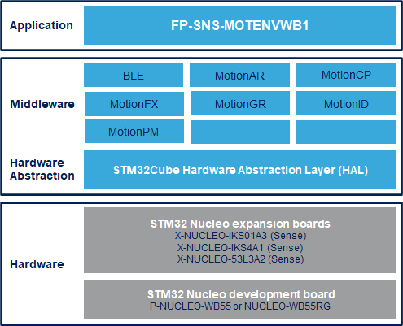

# FP-SNS-MOTENVWB1 Firmware Package

The FP-SNS-MOTENVWB1 is an STM32Cube function pack for STM32WB which lets you connect your IoT node to a smartphone via BLE and use a suitable AndroidT or iOST like the ST BLE Sensor app
to view real-time environmental sensor data, motion sensor data and time-of-flight sensors data.
The package also enables advanced functionality such as sensor data fusion and accelerometer-based real-time activity recognition, carry position, gesture recognition, pedometer, motion Intensity, campass and objects distance.
This package, together with the suggested combination of STM32WB and ST devices can be used to develop specific wearable applications, or smart things applications in general.

The software runs on the STM32WB microcontroller and includes all the necessary drivers to recognize the devices on the STM32WB Nucleo development board and expansion boards.

The expansion is built on STM32Cube software technology to ease portability across different STM32 microcontrollers.

**FP-SNS-MOTENVWB1 software features**:

- Complete firmware to develop an IoT node with BLE connectivity, environmental, motion and time-of-flight sensors

- Middleware libraries for sensor data fusion and acelerometer-based real-time activity recognition, carry position, gesture recognition, motion intensity recognition and pedometer.

- Firmware compatible with ST BLE Sensor applications for Android/iOS, to perform sensor data reading, motion algorithm features demo and firmware update (FOTA)
(Version 5.0.0/5.0.0 or higher)

- Easy portability across different MCU families, thanks to STM32Cube

This firmware package includes Components Device Drivers, Board Support Package and example application for the STMicroelectronics:

- P-NUCLEO-WB55 Nucleo-68 board with STM32WB55 MCU supporting Bluetooth™ 5 and 802.15.4 connectivity
- X-NUCLEO-IKS01A3 Expansion board for six MEMS sensor devices:
 - HTS221, LIS2DW12, LIS2MDL, LPS22HH, LSM5DSO
- X-NUCLEO-IKS4A1 Expansion board for six MEMS sensor devices:
 - STTS22H, SHT40AD1B, LPS22DF, LSM6DSV16X, LIS2MDL
- X-NUCLEO-53L3A2  Multi-targets ranging sensor expansion board based on VL53L3CX for STM32 Nucleo (optional).
  

Here is the list of references to user documents:

- [DB3966: STM32Cube function pack for STM32WB with BLE connectivity and environmental, motion and time-of-flight sensors ](https://www.st.com/resource/en/data_brief/fp-sns-motenvwb1.pdf)
- [UM2613: Getting started with the STM32Cube function pack for STM32WB with BLE connectivity and environmental, motion and time-of-flight sensors](https://www.st.com/resource/en/user_manual/um2613-getting-started-with-the-stm32cube-function-pack-for-stm32wb-with-ble-connectivity-and-environmental-and-motion-sensors-stmicroelectronics.pdf)
- [FP-SNS-MOTENVWB1 Quick Start Guide](https://www.st.com/content/ccc/resource/sales_and_marketing/presentation/product_presentation/group0/b5/d0/d6/69/23/4e/41/07/FP-SNS-MOTENVWB1_QUICK_STRART_GUIDE/files/fp-sns-motenvwb1_quick_start_guide.pdf/jcr:content/translations/en.fp-sns-motenvwb1_quick_start_guide.pdf)

## Supported Devices and Boards

- P-NUCLEO-WB55 Bluetooth 5 and 802.15.4 Nucleo Pack including USB dongle and Nucleo-64 with STM32WB55 MCUs, supports Arduino and ST morpho connectivity \[[P-NUCLEO-WB55](https://www.st.com/content/st_com/en/products/evaluation-tools/product-evaluation-tools/mcu-mpu-eval-tools/stm32-mcu-mpu-eval-tools/stm32-nucleo-boards/p-nucleo-wb55.html)\]
- X-NUCLEO-IKS01A3 Motion MEMS and environmental sensor expansion board for STM32 Nucleo \[[X-NUCLEO-IKS01A3](https://www.st.com/en/ecosystems/x-nucleo-iks01a3.html)]
- X-NUCLEO-IKS4A1 Motion MEMS and environmental sensor expansion board for STM32 Nucleo \[[X-NUCLEO-IKS4A1](https://www.st.com/en/ecosystems/x-nucleo-iks4a1.html)]
- X-NUCLEO-53L3A2 Motion MEMS and environmental sensor expansion board for STM32 Nucleo \[[X-NUCLEO-53L3A2](https://www.st.com/en/evaluation-tools/x-nucleo-53l3a2.html)\]

## Known Issues

Related to Keil µVision 5:

- If the constant CFG_DEBUG_APP_TRACE is egual to 1 for enabling the printf, the application doesnt't work
	
## Development Toolchains and Compilers

-   IAR Embedded Workbench for ARM (EWARM) toolchain V9.20.1 + STLink/V2
-   RealView Microcontroller Development Kit (MDK-ARM) toolchain V5.37.0 + ST-LINK/V2
-   Integrated Development Environment for STM32 (STM32CubeIDE) V1.14.0 + ST-LINK
	
## Dependencies 

This software release is compatible with:

- [**ST BLE Sensor Android application**](https://play.google.com/store/apps/details?id=com.st.bluems)  V5.0.0 (or higher)
- [**ST BLE Sensor iOS application**](https://apps.apple.com/it/app/st-ble-sensor/id993670214)  V5.0.0 (or higher)
